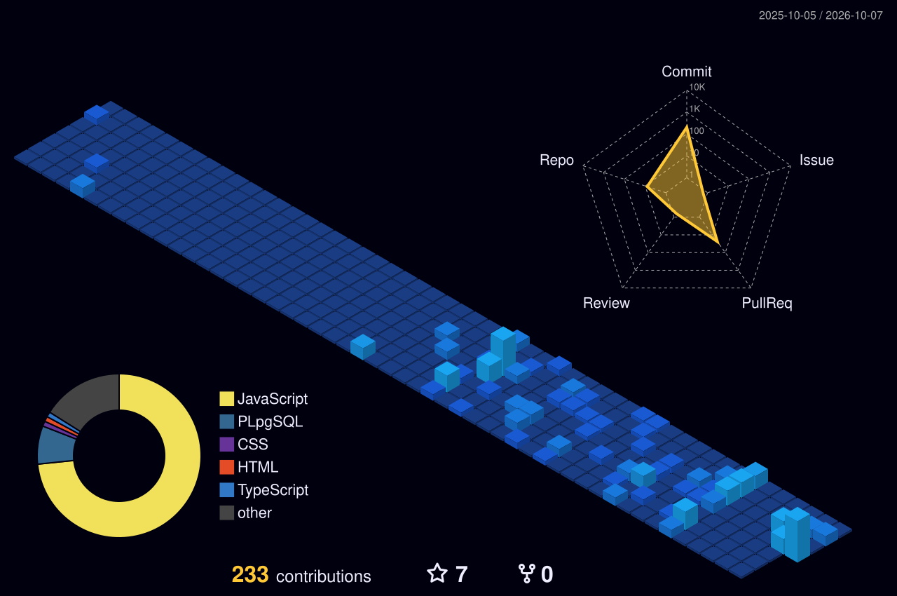

<!-- UMER YASIR — REIMAGINED GITHUB PROFILE -->

  

  

  
  
  

  

  

  

### 💼 Selected Engineering Focus

| Domain | Architecture & Technologies |
|---|---|
| **Enterprise Platforms** | Business workflows, dashboards, audits, reporting and operational systems |
| **Backend Engineering** | Spring Boot services, REST APIs, authentication, RBAC and data access |
| **Full Stack Products** | React / Next.js interfaces backed by scalable APIs |
| **Healthcare Systems** | Healthcare integrations, eligibility/RCM workflows and data exchange |
| **Cloud & Deployment** | AWS, Docker, Nginx, PM2 and production deployment workflows |

  

## 🏙️ GitHub 3D Contribution City

  

<!-- 

  
  

  

 -->

  <a href="https://github.com/umer-yasir"><b>GitHub</b></a> •
  <a href="https://www.linkedin.com/in/umeryasir/"><b>LinkedIn</b></a> •
  <a href="https://umeryasir.netlify.app/"><b>Live Portfolio</b></a>

 
---
